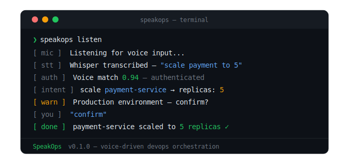

# 🎙️ SpeakOps

> **Talk to your infrastructure. It listens.**

SpeakOps is an open-source, voice-driven DevOps orchestration layer that attaches to any CI/CD pipeline — without rewrites, without migrations. Define your infrastructure commands once in YAML. Execute them with your voice.

```bash
$ speakops listen

🎙️  Listening...
👤  Voice authenticated — Shubham
🧠  Intent: scale payment-service to 5 replicas
⚠️   Production environment detected — confirm?
✅  Confirmed — scaling payment-service to 5 replicas
🟢  Done — payment-service scaled successfully
```

---
<p align="center">
  
</p>

## The Problem

Every DevOps engineer knows this moment.

It's 3am. Production is down. You're half asleep, trying to remember the exact `kubectl` command, typing it wrong twice, making things worse.

The tools we have today either:
- **Just alert you** — PagerDuty wakes you up but you still have to do everything manually
- **Only work in Slack** — Botkube shows you what's happening but won't act
- **Require a browser** — Rundeck needs you to find the right button while your hands are shaking

**Nobody built the action layer. Until now.**

---

## What SpeakOps Does

SpeakOps sits on top of your existing pipeline as a voice interface layer.

```
Your Voice
    ↓
Whisper STT  — locally, securely, offline
    ↓
Intent Engine — LLM understands what you mean
    ↓
Safety Layer — confirms before touching production
    ↓
Connectors — Kubernetes, Jenkins, ArgoCD, Grafana
    ↓
Voice Response — tells you what happened
```

No pipeline rewrites. No new infrastructure. Just attach and talk.

---

## Core Features

### 🎙️ Voice Orchestration
Natural language. No syntax memorization.
```
"Scale up the payment service"         →  kubectl scale
"Deploy main branch to staging"        →  Jenkins pipeline trigger
"What's broken right now"              →  auto incident diagnosis
"Show me the monitoring dashboard"     →  Grafana opens
"Rollback the last deployment"         →  ArgoCD rollback
```

### 📄 Config-Driven Everything
One YAML file. Engineer defines it once. SpeakOps handles the rest.
```yaml
voice_commands:
  - intent: "scale {service} to {replicas}"
    action:
      type: kubernetes
      operation: scale
    confirm_in: [production]
```

### 🔐 Voice Biometric Authentication
Your voice is your password. No third-party services. Fully local.
```
Enrollment  →  speak 3 phrases, voice profile stored encrypted locally
Every use   →  voice verified before any command executes
Production  →  strictest threshold — no exceptions
```

### 🛡️ 6-Layer Security Stack
```
Layer 1  →  Voice Biometric     who is speaking
Layer 2  →  RBAC                what they can do
Layer 3  →  Environment Check   where they can do it
Layer 4  →  Confirmation Gate   double check on production
Layer 5  →  Blast Radius        block dangerous commands
Layer 6  →  Audit Trail         everything recorded
```

### 🔌 Universal Connectors
```
Kubernetes   →  scale, logs, status, rollback, helm
Jenkins      →  trigger, status, cancel, logs
ArgoCD       →  sync, rollback, health, diff
Grafana      →  dashboards, metrics
Prometheus   →  queries, alerts
Vault        →  secrets management
```

### 🚨 Incident Response Mode
Alert fires → SpeakOps auto-gathers full context.
```
Failing pods + recent deploys + error logs + resource pressure
→ one summary
→ suggested actions
→ you just say what to do next
```

### 🖥️ Multi-Interface
One engine. Every interface.
```
speakops listen          →  voice mode
speakops run "command"   →  text fallback
REST API                 →  programmatic control
Slack bot                →  team use (coming soon)
```

---

## Why SpeakOps vs Everything Else


---

## Quick Start

```bash
# Install
pip install speakops

# Initialize in your project
speakops init

# Enroll your voice
speakops enroll

# Validate your config
speakops validate

# Start listening
speakops listen
```

---

## CLI Commands

```bash
speakops listen              # voice mode — primary interface
speakops run "command"       # text mode — same engine
speakops attach              # attach to any existing project
speakops validate            # validate voice.config.yaml
speakops dry-run "command"   # preview without executing
speakops audit               # view command history
speakops status              # cluster + connector health
speakops enroll              # voice profile setup
speakops env use staging     # switch active environment
```

---

## Configuration

```yaml
# voice.config.yaml

meta:
  project: my-app
  version: "1.0"

environments:
  staging:
    namespace: staging
    auto_confirm: true
  production:
    namespace: production
    auto_confirm: false

connectors:
  kubernetes:
    type: eks
    cluster: my-cluster.ap-south-1.eksctl.io
    package_manager:
      type: helm
      chart_path: ./helm/my-app
  cicd:
    type: jenkins
    url: http://jenkins.internal:8080
    credentials: vault://jenkins/token
  gitops:
    type: argocd
    url: https://argocd.internal

voice_commands:
  - intent: "scale {service} to {replicas}"
    action:
      type: kubernetes
      operation: scale
    confirm_in: [production]

  - intent: "deploy {branch} to {environment}"
    action:
      type: cicd
      operation: trigger_workflow
    confirm_in: [production]

security:
  voice_auth:
    enabled: true
    enrollment_samples: 3
    similarity_threshold: 0.85
    per_environment:
      production:
        threshold: 0.92
  dry_run_mode: false
  max_replicas_voice: 20
```

---

## Tech Stack

```
Speech-to-Text    →  OpenAI Whisper (local, offline, free)
Intent Engine     →  LLM (Claude / OpenAI) with structured output
Voice Auth        →  Custom MFCC-based speaker verification (no 3rd party)
K8s Client        →  Official Kubernetes Python SDK
CLI               →  Click + Rich
Config            →  PyYAML + Pydantic
Secrets           →  HashiCorp Vault integration
```

---

## Roadmap

```
V1  — Voice + Kubernetes + YAML config + CLI           ← current
V2  — Multi-connector + RBAC + Audit logs
V3  — Go binary + Helm chart + Plugin ecosystem
V4  — Incident mode + Web UI + REST API
V5  — SpeakOps Cloud + Enterprise tier
```

---

## Project Structure

```
SpeakOps/
├── speakops/
│   ├── config/         schema + validation
│   ├── engine/         LLM intent parsing
│   ├── connectors/     kubernetes, jenkins, argocd
│   └── cli/            terminal interface
├── examples/
│   └── voice.config.yaml
├── tests/
└── docs/
```

---

## Security

SpeakOps is designed for production environments. Key principles:

- **Voice biometric data** never leaves your machine
- **No credentials** in config files — Vault references only
- **All audio** processed in memory, never written to disk
- **Every command** logged with voice match score and outcome
- **Dangerous operations** require explicit confirmation always

Found a security issue? Please open a private security advisory on GitHub.

---

## Contributing

SpeakOps is in early development. All contributions welcome.

- 🐛 Found a bug? Open an issue
- 💡 Have an idea? Start a discussion
- 🔌 Want to build a connector? Check `docs/connectors.md`
- ⭐ Like the project? Star the repo — it helps a lot

---

## Built By

**Shubham Gupta** — DevOps & Cloud Engineer
B.Tech IT — Madhav Institute of Technology and Science, Gwalior

[](https://github.com/Shubham12gupta)

---

## License

MIT License — free forever, open forever.

---

> *"The tools that make us faster shouldn't slow us down to use."*
